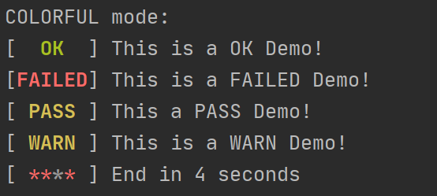
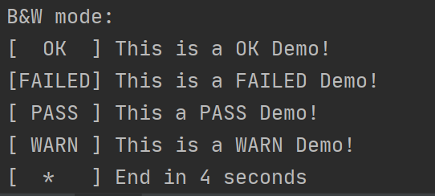

# SyetemdLike-CLI-StatusIndicator
This module is a simple status indicator which liked systemd initialization style
We provide four styles of status include OK/FAILED/PASS/WARN/InProgress. 
 
also support black&white style mode for some old console like Windows 7‘s cmd 
 

## Usage
You can watch the demo.py 